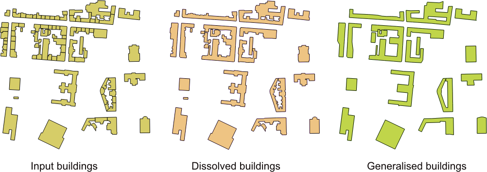

# CartoLineGen
QGIS Plugin for cartographic generalisation (simplification and smoothing) of lines and polygons

Since ver. 0.4. new simple algorithm for lines with orthogonal segments is added which can be usefull for buildings generalisation. 

The typical generalization combines simplification followed by smoothing. It is possible to apply only simplification or smoothing if needed.

In process of implemented line simplification the complexity of vector features is reduced. The simplified lines preserve the areas of regions which they might bound. The algorithm transforms a line into another line consisting of fewer vertices and approximate the original line. Resulting lines consist of a subset of points of the original line and new points.

By preserving the area, features will have some additional properties. The maximal generalization will result in convex shape of line (polygon). Selection or filtering based on area can be performed prior or after the generalization.

In process of implemented line smoothing, sharp corners are smoothed by adding new points (with an area preservation constraint). The smoothness is controled by the value of minimal angle of connected segments. The default value of constant ANGLE_THRESH=150(degrees) will give good results in most cases. By increasing this value more points (short segments) are added in order to smooth sharp corners.

Smoothing and simplification algorithms implemented in this plugin work line by line, i.e. simplification/smoothing of one line does not affect the other lines; they are treated separately. Nevertheless, borders of adjacent polygons tend to be very close. This is because line is not modified in order of vertex index, but based on geometrical properties of segments and angles between them. Also, the first and the last point of each open line is never translated and/or deleted. The closed lines can be modified on every point, improving result.

The main parameter is map scale given as value of map scale denominator. The amount of generalization is controlled by modifying only those parts of line where less then minimal length of segments occure and three neighbouring segments form the "s" shape. Minimal length was determined by analysing coastlines of manually generalised paper maps in diferent scales. It's value is around 0.05 mm at the map scale.

REFERENCES

Tutić, D., Lapaine, M. (2009): Area Preserving Cartographic Line Generalization, Cartography and Geoinformation, Vol. 8, No. 11, 84-100, http://www.kartografija.hr/kig/upload/clanci/kig11_Tutic2.pdf.

Tutić, D., Lapaine, M. (2010): New Method for Reducing Sharp Corners in Cartographic Lines with Area Preservation Property. Proceedings of the 14th International Conference on Geometry and Graphics, Kyoto, 289-290, http://bib.irb.hr/datoteka/480211.Tutic_Lapaine_full_paper.pdf.

Author: Dražen Tutić, University of Zagreb, Faculty of Geodesy, e-mail: dtutic@geof.hr

Contributor(s): Nikola Mrkalj, University of Zagreb, Faculty of Geodesy (help with plugin migration to QGIS3)

Last update: 06/09/2018
